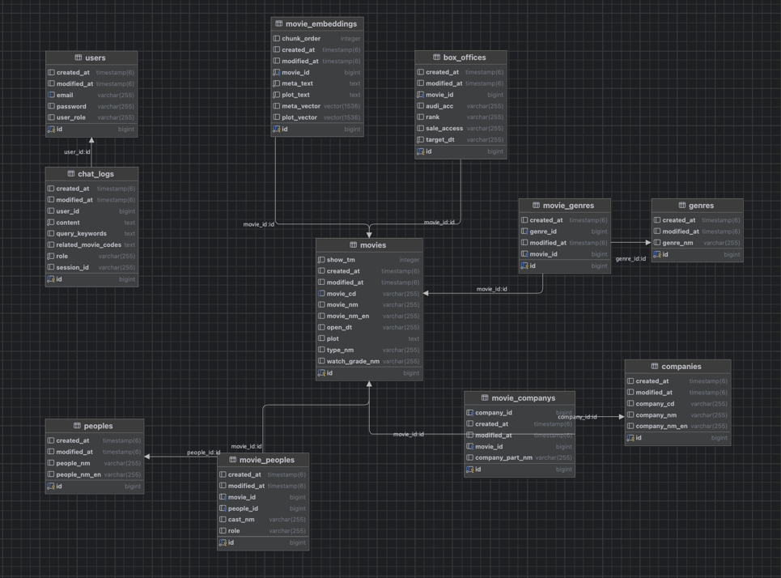

# CineMind (시네마인드)

영화 정보 및 추천을 위한 지능형 RAG 챗봇 서비스
CineMind는 사용자의 질문 의도를 파악하여 영화 정보를 검색하고, LLM(Large Language Model)을 통해 자연스러운 답변과 추천을 제공하는 AI 챗봇 서비스입니다.

## 목차
- [프로젝트 소개](#프로젝트-소개)
- [기술 스택](#기술-스택)
- [시스템 아키텍처](#시스템-아키텍처)
- [주요 기능](#주요-기능)
- [RAG 워크플로우](#RAG-워크플로우)
- [시작하기 (Installation)](#시작하기)
- [API 명세서](#API-명세서)
- [ERD (Entity Relationship Diagram)](#ERD)
- [배포 및 인프라](#배포-및-인프라)

## 프로젝트 소개
개발 기간: 2024.10 ~ 2024.12\
개발 인원: 1명 (Full Stack)\
목표: 기존 영화 검색의 한계를 넘어, "줄거리"나 "분위기" 기반의 검색이 가능한 서비스 구현\
RAG(검색 증강 생성) 기술과 Vector DB를 활용한 AI 챗봇 구축\
Docker Compose를 활용한 개발 환경 표준화 및 AWS EC2 자동 배포 파이프라인 구축

## 기술 스택
### Backend
Language: Kotlin, openjdk version 17.0.15\
Framework: Spring Boot 3.5.6\
Database: PostgreSQL 17.6 (with pgvector 0.8.1), Redis Stack 7.4.7 (RedisSearch)\
AI/LLM: OpenAI API (GPT-4o-mini, text-embedding-3-small)

Test: JMeter

### Frontend
Language: TypeScript\
Framework: React, Vite\
Styling: CSS Modules

### Infra & DevOps
Cloud: AWS EC2\
Server: Nginx (Reverse Proxy, SSL/TLS)\
CI/CD: GitHub Actions (Self-hosted Runner)\
Container: Docker, Docker Compose

## 시스템 아키텍처

(여기에 시스템 구성도를 이미지로 넣는다. 예: User -> Nginx -> Spring Boot -> DB/Redis/LLM)

## 주요 기능
AI 영화 챗봇\
자연어 질문 의도 파악\
영화 줄거리 및 메타데이터 기반 RAG 검색\
LLM을 활용한 답변 생성 및 영화 추천\
영화 데이터 자동 동기화\
KOFIC, KMDB API 연동 및 스케줄링을 통한 최신 영화 데이터 업데이트\
검색 성능 최적화\
Redis Semantic Cache 도입으로 동일/유사 질문 응답 속도 개선 (4.9s -> 0.4s)\
PostgreSQL pgvector 및 RedisSearch를 활용한 하이브리드 검색

## RAG 워크플로우
사용자 질문 처리 및 답변 생성 과정은 다음과 같습니다.\
사용자 질문: "반전이 있는 스릴러 영화 추천해줘"\
임베딩: 질문을 Vector로 변환 (OpenAI Embedding API)\
캐시 조회: Redis Semantic Cache에서 유사 질문 확인 (Hit 시 즉시 응답)\
벡터 검색: PostgreSQL(pgvector)에서 가장 유사한 줄거리/메타데이터 검색\
프롬프트 생성: 검색된 정보(Context)와 질문을 조합하여 프롬프트 작성\
LLM 답변 생성: OpenAI Chat Completion API 호출\
응답: 사용자에게 최종 답변 전달

## 시작하기
도메인: https://cinemind.me
Docker만 있으면 OS 상관없이 즉시 실행 가능합니다.

### 환경 변수 설정
프로젝트 루트에 .env 파일을 생성하고 다음 정보를 입력하세요.

### Database
DB_HOST=db\
DB_PORT=5432\
DB_NAME=cine_mind\
DB_USER=DB 유저명\
DB_USER_PASSWORD=DB 비밀번호

### Redis
REDIS_HOST=redis\
REDIS_PORT=6379

### External APIs
JWT_SECRET_KEY=your_secret_key\
KOFIC_API_KEY=your_kofic_key\
KMDB_API_KEY=your_kmdb_key\
OPENAI_API_KEY=your_openai_key\
ADMIN_EMAIL=admin@cinemind.me\
ADMIN_PASSWORD=admin1234

### 실행
docker compose up --build\
Frontend: http://localhost:5173\
Backend: http://localhost:8081\

## API 명세서
| Method | URI              | Description  | Request Body                                                  | Response                                                                                                                                                                                                                                                                                                                                               |
|--------|------------------|--------------|---------------------------------------------------------------|--------------------------------------------------------------------------------------------------------------------------------------------------------------------------------------------------------------------------------------------------------------------------------------------------------------------------------------------------------|
| POST   | /api/auth/signup | 회원가입         | { "email": "test1@test.com", "password": "1234" } | { "bearerToken": "Bearer ey", "id": 1, "email": "test1@test.com", "createdAt": "2025-12-01T01:00:00.486648" }                                                                                                                                                                                                                      |
| POST   | /api/auth/signup | 로그인          | { "email": "test1@test.com", "password": "1234" } | { "bearerToken": "Bearer ey" }                                                                                                                                                                                                                                                                                                                 |
| POST   | /api/chat        | 사용자 질문 요청    | { "userQuery": "모아나 2는 어떤 영화지?" }                     | { "answer": "영화 '모아나 2는~~', "sources": [] }                                                                                                                                                                                                                                                                                                |
| GET    | /api/chat-logs   | 인증된 사용자 대화내역 |                                                               | [ { "role": "user", "content": "모아나 2는 어떤 영화지?", "createdAt": "2025-12-01T01:00:00.301702", "queryKeywords": [], "relatedMovieCodes": [] }, { "role": "assistant", "content": "영화 '모아나 2'는 ~~~" "createdAt": 2025-12-01T01:01:11.364459", "queryKeywords": [], "relatedMovieCodes": [] } ] |
| POST   | /api/rebuild-all | 영화 전체 수동 인덱싱 | | 200 OK, MESSAGE(관리자(1)에 의해 전체 RAG 인덱스 재구축 완료)                                                                                                                                                                                                                                                                                                          |
| POST   | /api/incremental | 신규 영화 수동 인덱싱 | | 200 OK, MESSAGE(관리자(1): 새로 인덱싱할 영화 데이터가 없습니다.)                                                                                                                                                                                                                                                                                                         
| GET | /api/health | 헬스체크 | | { "status": "UP", "db": "UP", "redis": "UP", "details": {} }                                                                                                                                                                                                                                                                       |

## ERD

## 배포 및 인프라
AWS EC2: 단일 인스턴스에 Docker 기반 서비스 배포\
Nginx: SSL 적용 (Let's Encrypt)\
GitHub Actions:\
main 브랜치 Push 시 자동 빌드 및 배포\
Self-hosted Runner를 사용하여 보안 강화 (22번 포트 미개방)
